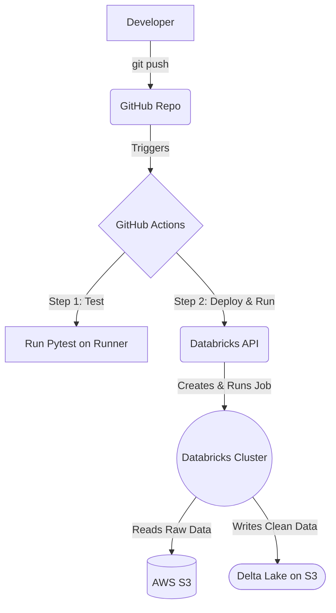

# Databricks ETL Pipeline with GitHub Actions CI/CD


This repository contains a production-style ETL (Extract, Transform, Load) pipeline. It demonstrates how to automate a data cleaning process using PySpark on Databricks, with CI/CD orchestration handled by GitHub Actions and data storage managed on AWS S3 with Delta Lake.

## Architecture Overview

The pipeline follows a modern CI/CD approach for data engineering. The entire process is triggered by a `git push` to the `main` branch.



---

## Key Features

-   **Automated CI/CD**: The entire pipeline for testing, deploying, and running the Spark job is automated with GitHub Actions.
-   **Infrastructure as Code**: The Databricks job definition (cluster specs, task to run) is codified within the `.github/workflows/main.yml` file.
-   **Separation of Concerns**: Python application logic (`src/`) is separate from test code (`tests/`) and CI/CD definitions (`.github/`).
-   **Unit Testing**: The PySpark transformation logic is unit-tested using `pytest` on every push to ensure code quality.
-   **Secure by Design**: Uses Databricks Secrets and AWS IAM Roles for secure, keyless authentication between services. No credentials are hardcoded.
-   **Reliable Data Storage**: Leverages Delta Lake on AWS S3, providing ACID transactions, time travel, and schema enforcement for the data warehouse layer.

---

## Prerequisites & Setup

To replicate this environment, you need accounts for AWS, GitHub, and Databricks. Follow these steps to configure the connections.

### 1. AWS Setup

1.  **S3 Bucket**: Create an S3 bucket to store the final Delta Lake table.
2.  **IAM Policy**: Create an IAM policy that grants read/write permissions to the S3 bucket. (See `iam_policy.json` example in this repo if needed).
3.  **IAM Role**: Create an IAM Role for cross-account access.
    -   **Trusted Entity**: `Another AWS account`.
    -   **Databricks Account ID**: `414351767826`.
    -   **Require External ID**: Your Databricks Workspace ID (from the workspace URL, e.g., `o=12345...`).
    -   Attach the IAM policy created in the previous step. Name the role `DatabricksS3Role`.
4.  **IAM Instance Profile (Critical)**: An instance profile is **not** created automatically. You must create it manually using the AWS CLI and attach the role to it.

    ```bash
    # Create the instance profile container
    aws iam create-instance-profile --instance-profile-name DatabricksS3Role

    # Attach the role to the instance profile
    aws iam add-role-to-instance-profile --instance-profile-name DatabricksS3Role --role-name DatabricksS3Role
    ```

### 2. Databricks Setup

1.  **Add Instance Profile**: In the Databricks Admin Console, go to **Workspace Settings** > **Instance Profiles** and add the ARN of the instance profile you just created. It will look like `arn:aws:iam::ACCOUNT_ID:instance-profile/DatabricksS3Role`.
2.  **Generate Access Token**: In **User Settings** > **Access Tokens**, generate a Personal Access Token (PAT) for GitHub Actions to use.

### 3. GitHub Setup

1.  **Create Repository**: Clone this repository or set up your own with the same structure.
2.  **Configure Secrets**: In your repository's **Settings** > **Secrets and variables** > **Actions**, add the following repository secrets:
    -   `DATABRICKS_HOST`: Your Databricks workspace URL (e.g., `https://dbc-a1b2345c-d67e.cloud.databricks.com`).
    -   `DATABRICKS_TOKEN`: The Personal Access Token you generated in Databricks.

---

## Configuration

To adapt this pipeline for your use, you may need to change the following:

-   **`src/pipeline.py`**: Update the `DELTA_TABLE_PATH` variable to point to your S3 bucket.
-   **`.github/workflows/main.yml`**:
    -   Update the `instance_profile_arn` in the `databricks jobs submit` JSON block to match your AWS account and role name.
    -   Adjust the `node_type_id` or `num_workers` under `new_cluster` to fit your performance needs.

## How the CI/CD Pipeline Works

The entire flow is defined in `.github/workflows/main.yml`:

1.  **Trigger**: The workflow starts on any `push` to the `main` branch.
2.  **Checkout & Setup**: A GitHub Actions runner checks out the code and sets up a Python environment.
3.  **Install Dependencies**: It installs `pyspark` and `pytest` from the `requirements.txt` file.
4.  **Test (CI)**: It runs the unit tests using the `pytest` command. If any test fails, the pipeline stops here.
5.  **Deploy & Run (CD)**:
    -   If tests pass, it installs the `databricks-cli`.
    -   It copies the main script `src/pipeline.py` to a location in DBFS.
    -   It then submits a one-time job run to the Databricks Jobs API, using a JSON definition that specifies a new job cluster with the attached IAM role and points to the Python script on DBFS.

## Local Development and Testing

You can run the unit tests locally before pushing your code to GitHub.

```bash
# Set up a virtual environment (recommended)
python3 -m venv .venv
source .venv/bin/activate

# Install dependencies
pip install -r requirements.txt

# Run tests
pytest
```

## Project Structure

```
.
├── .github/
│   └── workflows/
│       └── main.yml         # GitHub Actions CI/CD definition
├── src/
│   └── pipeline.py          # Core PySpark ETL logic
├── tests/
│   └── test_pipeline.py     # Unit tests for the transformation logic
├── requirements.txt         # Python dependencies for testing
└── README.md                # This file
```